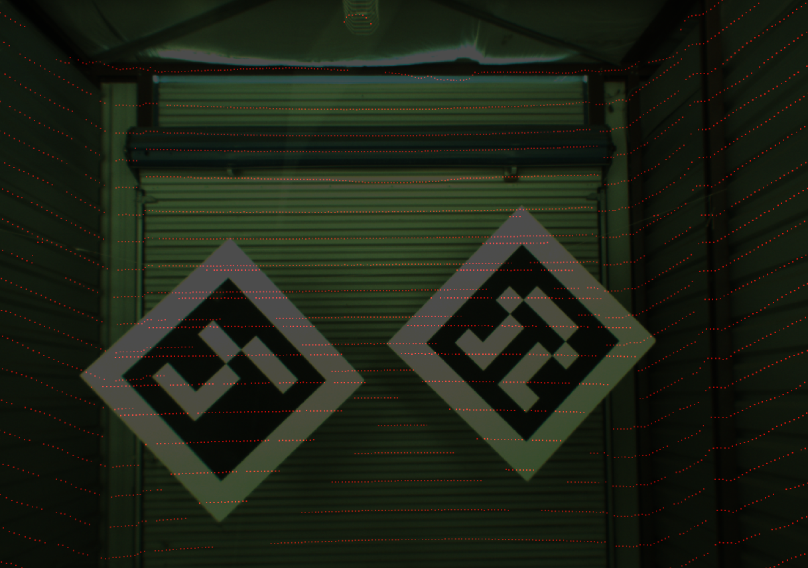
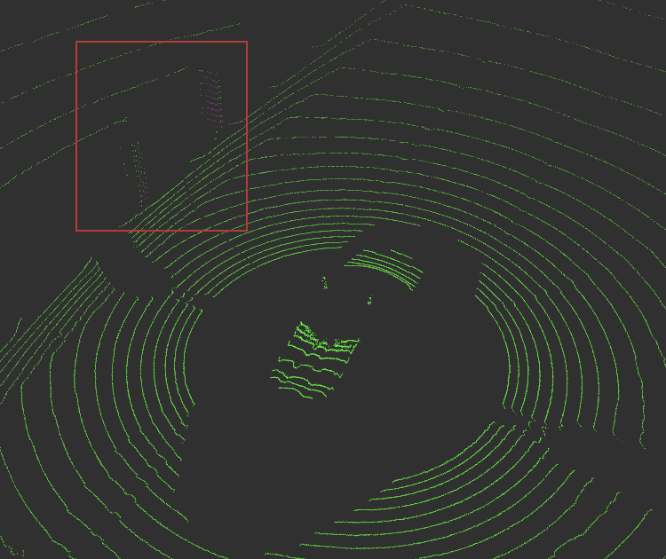
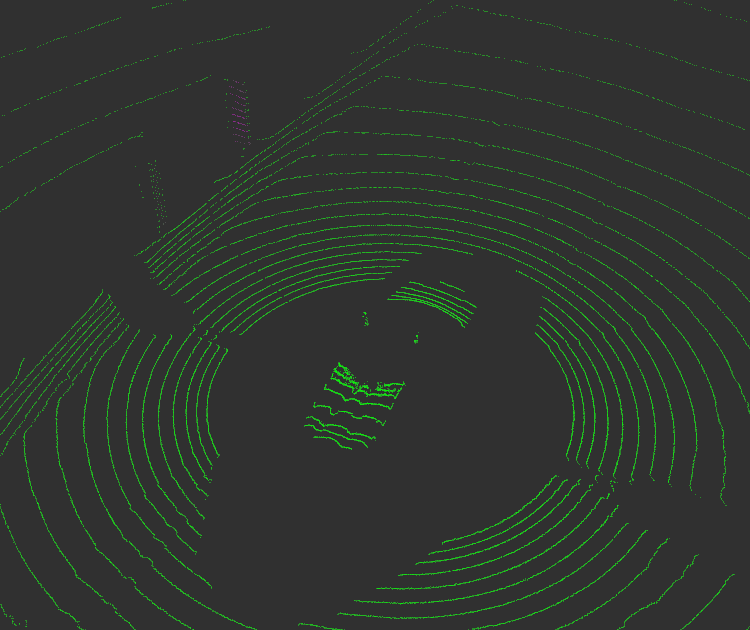
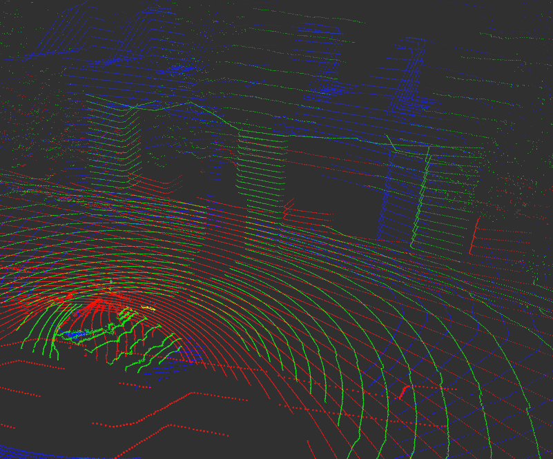

# Autonomous Vehicle System Building

## Lidar Configuration

## Sensor Calibration
### Multiple lidar calibration
During this project, there are two methods tried for multi-lidar calibration: GICP and Feature-based optimization.
#### 1. GICP
Offered by PCL library. 

Result of GICP for 3 Velodynes:

#### 2. Feature-based optimization
This feature-based optimization is created by using the feature-corresponding optimization algorithm of [LOAM](http://www.roboticsproceedings.org/rss10/p07.pdf) developed by Ji Zhang and Sanjiv Singh. LOAM is developed for locating and mapping given the data of one Velodyne. And the result of the map is very desirable even with large  transformation and rotation. Since this feature-corresponding algorithm can be used to mapping two point clouds collected at two different time, this approach can also be used for multiple lidar calibration which has displacement in the perspective of space. 

Result of featured-based optimization:

### Lidar camera calibration
For the lidar camera calibration, I follows the [publication](https://arxiv.org/abs/1705.09785) and [open source code](https://github.com/ankitdhall/lidar_camera_calibration) of Ankit Dhall, Kunal Chelani, Vishnu Radhakrishnan and K.M. Krishna. They use aruco markers to find the 3D-to-3D correspondences of the the board’s edge and the marker’s center from lidar and camera respectively. Then they use UPnP to iterate 100 times to obtain the final result of the lidar-to-camera transformation matrix.

Result of lidar camera calibration:

## Sensor Synchronization
The reason we need to do sensor synchronization is that the vehicle is moving in an speed that cannot be ignored and can result in wrong information collected about the environment.

Sensor synchronization deals with the time displacement which includes two aspects:

1. The difference of the time that all the points are collected in one period of the scanning for one Velodyne.

If we don’t synchronize the points collected in one period of scanning, the information of the environment is distorted and can result in duplication of objects:

After synchronization, the duplication is eliminated and the distortion is corrected:

2. The difference of the time that sensors finished the collection of data of one period.

The difference of information-arrive time of different sensors needs to be considered because the velocity of the vehicle can result in displacement in space during the difference of their time. For example, the pillars of a bridge is distorted without synchronization:

After synchronization, the displacement is removed:

Sensor synchronization can only deals with static objects. For those dynamic objects, new methods are needed to detect the speed of those objects before the correction of the distortion is implemented. 
