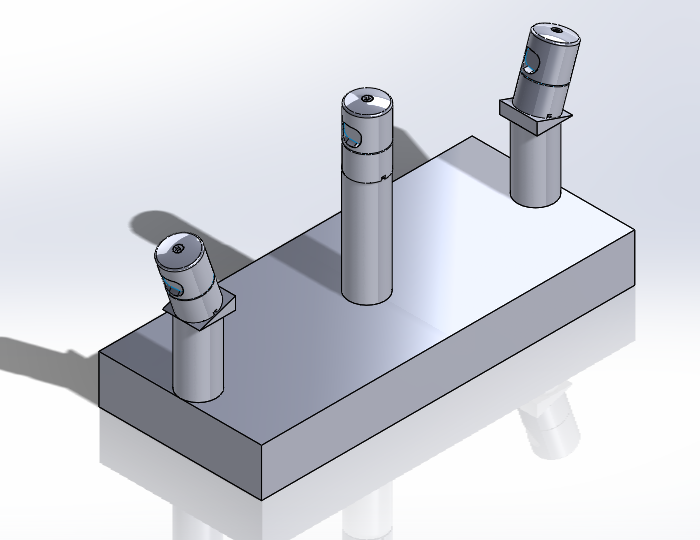
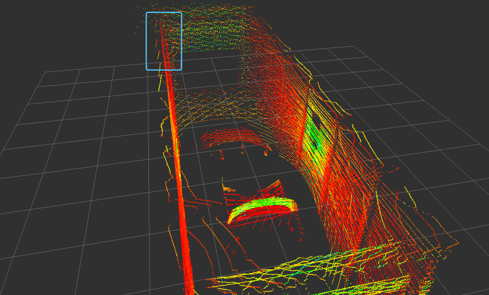

# Autonomous Vehicle System Building

## Lidar Configuration

## Sensor Calibration
### Multiple lidar calibration
During this project, there are two methods tried for multi-lidar calibration: GICP and Feature-based optimization.
#### GICCP
Offered by PCL library. 
Result of GICP for 3 Velodynes:

